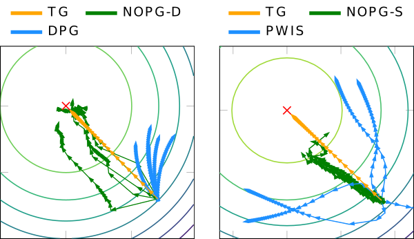

# Nonparametric Off-Policy Policy Gradient

<p float="middle">
  
  <a href="https://www.youtube.com/watch?v=LKtnzc4TV98">  </a>
</p>


<br>

Tosatto, S.; Carvalho, J.; Abdulsamad, H.; Peters, J. (2020). *A Nonparametric Off-Policy Policy Gradient*, Proceedings of the 23rd International Conference on Artificial Intelligence and Statistics (AISTATS). [https://arxiv.org/abs/2001.02435](https://arxiv.org/abs/2001.02435)

[Nonparametric Off-Policy Policy Gradient](https://arxiv.org/abs/2001.02435) (NOPG) is a Reinforcement Learning algorithm for off-policy datasets. The gradient estimate is computed in closed-form by modelling the transition probabilities with Kernel Density Estimation (KDE) and the reward function with Kernel Regression.

The current version of NOPG supports stochastic and deterministic policies, and works for continuous state and action spaces. An extension to discrete spaces will be made available in the near future.

It supports environments with openAI-gym like interfaces.

Link to CartPole video: [https://www.youtube.com/watch?v=LKtnzc4TV98](https://www.youtube.com/watch?v=LKtnzc4TV98)


## Install

The code was tested with Python 3.6.8 in a machine with Ubuntu 18.04 and uses PyTorch for automatic gradient computation. We recommend using a GPU and large RAM to improve the training speed.

Install all dependencies by running

```bash
bash setup.sh
```


## Run

The easiest way to create an experiment is to follow the template in [examples/template.py](examples/template.py) or directly look at the examples in the [examples](examples) directory.


## Example

**Swing-up Pendulum with Uniformly sampled dataset and Deterministic Policy**

Activate the virtual environment first and run the code with 
```python
python examples/pendulum_nopg_d_uniform.py
```
You should get roughly a non-discounted return close to -500.

